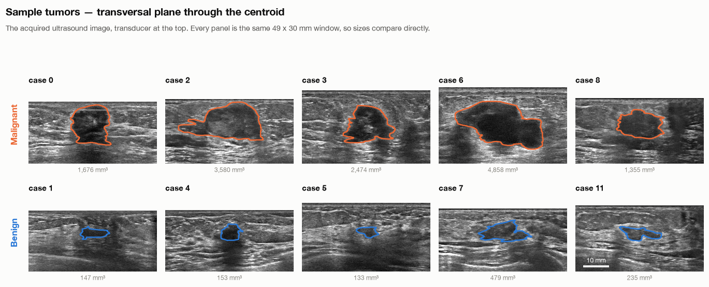
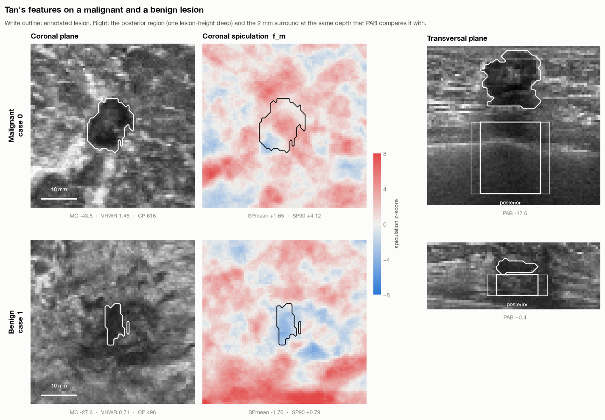
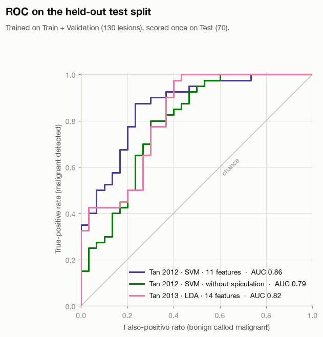
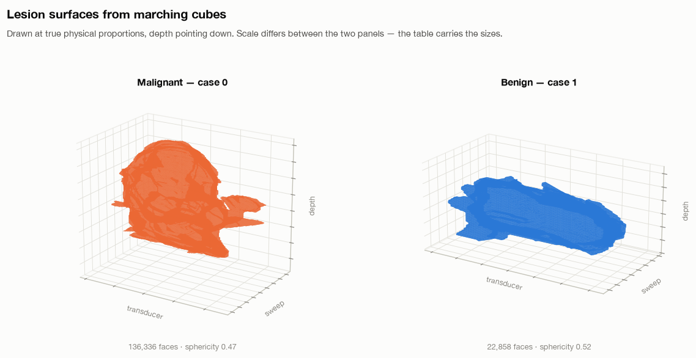

# Classification of Breast Cancer Lesions in 3D Automated Breast Ultrasound

**[Project page](https://alinaderiparizi.com/abus-classification/) · [Code](https://github.com/mralinp/abus-classification) · [Roadmap](#roadmap) · [Results so far](#results-so-far)**

Automated 3D breast ultrasound (ABUS) images the whole breast in a single sweep, but reading the
resulting volumes is slow, and telling malignant lesions from benign ones remains hard.

In previous work [7] we showed that the **Laplace–Beltrami spectrum of a lesion's surface** is an
effective feature for classifying breast masses in 3D ABUS. That paper established *that* it works,
not *why*. This project supplies the missing mathematics, toward a follow-up paper:

1. **Reproduce the strongest published results** on the public TDSC-ABUS 2023 dataset under one
   evaluation protocol, so every comparison is fair.
2. **Develop the mathematical foundations** of Laplace–Beltrami shape representation for tumors: what
   the spectrum provably captures about a lesion's shape, what it cannot, how stable it is, and how it
   relates to spherical harmonic decompositions.
3. **Derive better descriptors from that theory** and test whether they improve on the baselines.

The work is carried out at the Iran Image Processing Lab (IIPL) by Ali Naderiparizi and Sepideh Barekatrezaei,
under the supervision of Dr. Ehsan Kozegar and Dr. Mohsen Soryani (main supervisor). Code is released under
the MIT license.



---

## Results so far

All results below use the **official TDSC-ABUS test split** (70 lesions: 40 malignant, 30 benign).
Always answering "malignant" scores 57.1% accuracy on it.

| Method | Features / model | Test AUC | Test accuracy | Notes |
| --- | --- | --- | --- | --- |
| Tan et al. 2012, reproduced here | 11 radiomic features, RBF SVM | **0.86** (95% CI 0.77–0.94) | **78.6%** | CV AUC 0.83 ± 0.03 |
| Tan et al. 2012 without spiculation, reproduced here | 8 features, RBF SVM | 0.79 | 75.7% | CV AUC 0.74 |
| Tan et al. 2013, reproduced here | 14 features, LDA | 0.82 | 72.9% | CV AUC 0.82 |
| TDSC-ABUS challenge winner (T1, SZU) | 3D ResNet | 0.889 | 75.7% | reported in the challenge paper |
| Barekatrezaei et al. 2026 — our previous work [7] | Laplace–Beltrami spectra + dual-path CNN | 0.935 | 84.3% | reported in [7] |

> **Comparing across rows.** The reproductions here compute features from the ground-truth lesion
> masks. Challenge entries had to locate and segment lesions themselves, so their task was harder.
> Closing that gap — running every method on predicted segmentations as well — is part of Phase 2.

**What the reproductions show so far** (details in
[`tao2013.ipynb`](https://github.com/mralinp/abus-classification/blob/main/notebooks/tao2013.ipynb)):

- **Coronal spiculation replicates.** Tan's spiculation features score AUC 0.80–0.81 on their own,
  matching the 0.81–0.83 reported on their Nijmegen data, and removing them costs the classifier
  0.07 test AUC. They are not a proxy for lesion size.
- **Several classic ultrasound features do not transfer.** Posterior acoustic behavior falls to chance
  (AUC 0.50, against 0.80 in the paper), and the height-to-width ratio and margin contrast lose most of
  their signal.
- **Shape carries most of the signal on this data.** Among general radiomic features, boundary fractal
  dimension (AUC 0.75), surface area, compactness and sphericity (0.74) lead, while intensity features
  sit near chance — which motivates the shape-based approach in Phase 3.

| Tan's features on two lesions | ROC on the test split |
| --- | --- |
|  |  |

---

## Roadmap

Status: ✅ done · 🔄 in progress · ⬜ planned

### Phase 0 — Foundations ✅

| | Task | Where |
| --- | --- | --- |
| ✅ | Reproducible environment with [uv](https://docs.astral.sh/uv/) | `pyproject.toml`, `uv.lock` |
| ✅ | TDSC-ABUS data loading | [`tdsc-abus2023-pytorch`](https://github.com/mralinp/tdsc-abus2023-pytorch) |
| ✅ | Physical voxel spacing and ABUS plane geometry (transversal, coronal, sagittal) | `abus_classification/utils/spacing.py` |
| ✅ | Dataset statistics and visualization, in millimetres | [`visualization.ipynb`](https://github.com/mralinp/abus-classification/blob/main/notebooks/visualization.ipynb) |
| ✅ | Tested feature library (radiomic, Tan et al., spectral shape descriptors) | `abus_classification/features`, `test/` |

### Phase 1 — Reproduce classical radiomics ✅

| | Paper | Result on TDSC-ABUS test split |
| --- | --- | --- |
| ✅ | Tan et al. 2012 — coronal spiculation after the mammography stellate-lesion statistic [4], 11 features, SVM [1, 3] | AUC 0.86 |
| ✅ | Tan et al. 2013 — 14 features, LDA [2, 3] | AUC 0.82 |

### Phase 2 — Reproduce the strongest published results 🔄

Every method is re-run under one protocol: train on Train + Validation (130 lesions), report AUC with
a bootstrap confidence interval and accuracy on the official Test split, and compare pairs with
DeLong's test. Each is evaluated twice — from ground-truth masks and from predicted segmentations.

| | Paper | Approach |
| --- | --- | --- |
| ⬜ | Barekatrezaei et al. 2026 [7] — our previous work | Laplace–Beltrami spectra + dual-path CNN, stacked ensemble; re-run here as the reference baseline |
| ⬜ | TDSC-ABUS challenge top entries [5] | 3D ResNet (T1); 2.5D DenseNet201 with voting (T4); patch-based 3D ResNet-18 (T3) |
| 🔄 | Zhou et al. 2021 [6] | Multi-task V-Net: joint segmentation and classification — model implemented, evaluation pending |
| ⬜ | Yu et al. 2024 [8] | 2D-input networks with soft and hard voting across slices |
| ⬜ | [Breast cancer classification in ABUS using multiview CNN with transfer learning](https://pubmed.ncbi.nlm.nih.gov/32059918/) | Multiview 2D CNN |
| ⬜ | [Fully automatic classification of ABUS according to BI-RADS using a deep CNN](https://pubmed.ncbi.nlm.nih.gov/35147776/) | 2D deep CNN |
| ⬜ | Unified comparison table and statistical tests across all reproduced methods | — |

### Phase 3 — Mathematical foundations of Laplace–Beltrami shape representation ⬜

Our previous work [7] showed that Laplace–Beltrami spectra of the lesion surface separate malignant
from benign lesions well, but did not explain why. This phase supplies the mathematics: which
properties of a tumor's shape the spectrum provably captures, which it cannot, how stable it is under
the imperfections of real ultrasound segmentations, and how it relates to spherical harmonic
decompositions. Every claim is paired with an empirical check on TDSC-ABUS, and the theory is used to
derive better-founded descriptors.

| | Step | Notes |
| --- | --- | --- |
| ✅ | Watertight lesion surfaces | `utils.mesh.lesion_mesh`: meshes in millimetres; padding and no morphological closing keep all 200 surfaces closed |
| ✅ | Discrete Laplace–Beltrami operator | Cotangent scheme with lumped mass matrix, verified against the analytic spectrum of the unit sphere; convergence to the smooth operator depends on mesh conditions studied in [15, 16] |
| ⬜ | Invariance | Prove and verify invariance to rigid motion and isometric deformation, and normalise for scale (λₖ·Area) so lesions of different size are comparable |
| ⬜ | What the spectrum determines | Surface area from Weyl's law [17]; area and Euler characteristic from the heat-trace expansion [18]; and its limits, the question posed by Kac [19] |
| ⬜ | Roundness and irregularity | Hersch's inequality, λ₁·Area ≤ 8π on genus-0 surfaces with equality only for the round sphere [20], makes the first eigenvalue a provable measure of departure from roundness; relate higher eigenvalues to lobulation and spiculation |
| ⬜ | Stability | Bound how far eigenvalues move under surface perturbation, mesh resolution, voxel anisotropy and segmentation error, and measure it on TDSC-ABUS |
| 🔄 | Spectral descriptors | Shape-DNA [9], heat kernel signature [10], wave kernel signature [11], global point signature [12] — implemented, classification pending |
| ⬜ | Spherical harmonics | Spherical harmonics are the Laplace–Beltrami eigenfunctions of the sphere, so a spherical harmonic decomposition [13, 14] and the lesion's own spectrum are two views of one framework; it needs genus-0 surfaces, so voxel-derived surfaces with handles require topology correction first |
| ⬜ | Theory-driven descriptors | Design descriptors from the results above, fuse them with spiculation, intensity and CNN features, and evaluate under the Phase 2 protocol with ablations |



### Phase 4 — Paper ⬜

| | Task |
| --- | --- |
| ⬜ | Final experiments, ablations and statistical comparison |
| ⬜ | Figures and manuscript |
| ⬜ | Release of code, trained models and evaluation scripts |

---

## Datasets

### TDSC-ABUS 2023

The public dataset of the [TDSC-ABUS 2023 challenge](https://tdsc-abus2023.grand-challenge.org/): 200
ABUS volumes acquired with a GE Invenia ABUS at Harbin Medical University Cancer Hospital, each with a
voxel-level tumor mask and a malignant/benign label.

| Split | Volumes | Malignant | Benign |
| --- | --- | --- | --- |
| Train | 100 | 58 | 42 |
| Validation | 30 | 17 | 13 |
| Test | 70 | 40 | 30 |
| **Total** | **200** | **115** | **85** |

Access requires a signed data use agreement; see the
[dataset page](https://tdsc-abus2023.grand-challenge.org/Dataset/).

**Voxels are not cubes.** The volumes are 843–865 × 546–682 × 270–354 voxels at 0.200 mm along the
transducer, 0.073 mm in depth and 0.476 mm between slices, and the NRRD files do not record this. All
features and figures here use physical units; measured in voxels, lesions appear up to five times
thinner along one axis than they are.

### IIPL-3D-ABUS

A private dataset of 70 ABUS volumes (55 malignant, 15 benign) collected at the Iran Image Processing
Lab and segmented under the supervision of two expert radiologists. It cannot be shared; for enquiries,
contact <me@alinaderiparizi.com>.

---

## Getting started

### Install

The project is managed with [uv](https://docs.astral.sh/uv/), which also installs a suitable Python:

```bash
curl -LsSf https://astral.sh/uv/install.sh | sh
git clone https://github.com/mralinp/abus-classification.git
cd abus-classification
uv sync
```

`uv.lock` currently resolves for macOS, where PyTorch uses the Apple Silicon `mps` backend. To run on
Linux with CUDA, remove `environments` under `[tool.uv]` in `pyproject.toml` and run `uv lock`.

### Data

Place the TDSC-ABUS splits under `data/tdsc/`:

```text
data/tdsc/
├── Train/        DATA/, MASK/, labels.csv, bbx_labels.csv
├── Validation/
└── Test/
```

```python
from tdsc_abus2023_pytorch import TDSC, DataSplits
from abus_classification.features import tan

dataset = TDSC(path="data/tdsc", split=DataSplits.TRAIN, download=True)
volume, mask, label, bbox = dataset[0]          # label: 0 = malignant, 1 = benign

features = tan.extract_tan_features(volume, mask)   # millimetre-aware, uses TDSC-ABUS spacing
```

Passing `download=True` makes the dataset automatically downloaded if its not present on the system.

### Run

```bash
uv run pytest test/features_tests test/utils_tests   # feature library tests
uv run jupyter lab                                   # after: uv add --group notebooks jupyterlab
```

### Google Colab

```python
!git clone https://github.com/mralinp/abus-classification.git
%cd abus-classification
!pip install -e .
```

---

## Repository layout

| Path | Contents |
| --- | --- |
| `abus_classification/features/tan/` | Tan et al. (2012, 2013) features, including coronal spiculation |
| `abus_classification/features/radiology/` | General radiomic features in physical units |
| `abus_classification/features/shape_descriptor/` | Laplace–Beltrami operator, spectral signatures, boundary signatures |
| `abus_classification/features/texture/` | Grey-level co-occurrence texture features |
| `abus_classification/models/` | U-Net, V-Net, SE-FNet, multi-task V-Net |
| `abus_classification/utils/` | Meshing, voxel spacing and resampling, image utilities |
| `notebooks/` | Experiments — start with `visualization.ipynb` and `tao2013.ipynb` |
| `test/` | Unit tests |

---

## References

1. T. Tan, B. Platel, H. Huisman, C. I. Sánchez, R. Mus, N. Karssemeijer. Computer-aided lesion diagnosis in automated 3-D breast ultrasound using coronal spiculation. *IEEE Transactions on Medical Imaging* 31(5):1034–1042, 2012. [doi:10.1109/TMI.2012.2184549](https://doi.org/10.1109/TMI.2012.2184549)
2. T. Tan, B. Platel, T. Twellmann, G. van Schie, R. Mus, A. Grivegnée, R. M. Mann, N. Karssemeijer. Evaluation of the effect of computer-aided classification of benign and malignant lesions on reader performance in automated three-dimensional breast ultrasound. *Academic Radiology* 20(11):1381–1388, 2013. [doi:10.1016/j.acra.2013.07.013](https://doi.org/10.1016/j.acra.2013.07.013)
3. T. Tan. *Automated 3D breast ultrasound image analysis.* PhD thesis, Radboud University Nijmegen, 2014. [pdf](https://repository.ubn.ru.nl/bitstream/handle/2066/121931/121931.pdf)
4. N. Karssemeijer, G. M. te Brake. Detection of stellate distortions in mammograms. *IEEE Transactions on Medical Imaging* 15(5):611–619, 1996. [doi:10.1109/42.538938](https://doi.org/10.1109/42.538938)
5. G. Luo, M. Xu, H. Chen, X. Liang, X. Tao, D. Ni, et al. Tumor detection, segmentation and classification challenge on automated 3D breast ultrasound: the TDSC-ABUS challenge. arXiv:2501.15588, 2025. [arXiv](https://arxiv.org/abs/2501.15588)
6. Y. Zhou, H. Chen, Y. Li, Q. Liu, X. Xu, S. Wang, P.-T. Yap, D. Shen. Multi-task learning for segmentation and classification of tumors in 3D automated breast ultrasound images. *Medical Image Analysis* 70:101918, 2021. [ScienceDirect](https://www.sciencedirect.com/science/article/abs/pii/S1361841520302826)
7. S. Barekatrezaei, A. Naderiparizi, E. Kozegar, J. Ghofrani, M. Soryani. Breast mass classification in 3D ABUS based on Laplace-Beltrami spectra and dual path CNN. *Expert Systems with Applications* 299:129973, 2026. [doi:10.1016/j.eswa.2025.129973](https://doi.org/10.1016/j.eswa.2025.129973)
8. S. Yu, X. Liang, S. Zhao, Y. Xie, Q. Sun. Three-dimensional automated breast ultrasound (ABUS) tumor classification using a 2D-input network: soft voting or hard voting? *Applied Sciences* 14(24):11611, 2024. [doi:10.3390/app142411611](https://doi.org/10.3390/app142411611)
9. M. Reuter, F.-E. Wolter, N. Peinecke. Laplace–Beltrami spectra as "Shape-DNA" of surfaces and solids. *Computer-Aided Design* 38(4):342–366, 2006. [doi:10.1016/j.cad.2005.10.011](https://doi.org/10.1016/j.cad.2005.10.011)
10. J. Sun, M. Ovsjanikov, L. Guibas. A concise and provably informative multi-scale signature based on heat diffusion. *Computer Graphics Forum* 28(5):1383–1392, 2009. [doi:10.1111/j.1467-8659.2009.01515.x](https://doi.org/10.1111/j.1467-8659.2009.01515.x)
11. M. Aubry, U. Schlickewei, D. Cremers. The wave kernel signature: a quantum mechanical approach to shape analysis. *IEEE International Conference on Computer Vision Workshops*, 2011.
12. R. M. Rustamov. Laplace-Beltrami eigenfunctions for deformation invariant shape representation. *Eurographics Symposium on Geometry Processing*, 2007.
13. C. Brechbühler, G. Gerig, O. Kübler. Parametrization of closed surfaces for 3-D shape description. *Computer Vision and Image Understanding* 61(2):154–170, 1995. [doi:10.1006/cviu.1995.1013](https://doi.org/10.1006/cviu.1995.1013)
14. M. Kazhdan, T. Funkhouser, S. Rusinkiewicz. Rotation invariant spherical harmonic representation of 3D shape descriptors. *Eurographics Symposium on Geometry Processing*, 2003.
15. K. Hildebrandt, K. Polthier, M. Wardetzky. On the convergence of metric and geometric properties of polyhedral surfaces. *Geometriae Dedicata* 123(1):89–112, 2006. [doi:10.1007/s10711-006-9109-5](https://doi.org/10.1007/s10711-006-9109-5)
16. A. I. Bobenko, B. A. Springborn. A discrete Laplace–Beltrami operator for simplicial surfaces. *Discrete & Computational Geometry* 38(4):740–756, 2007. [doi:10.1007/s00454-007-9006-1](https://doi.org/10.1007/s00454-007-9006-1)
17. H. Weyl. Das asymptotische Verteilungsgesetz der Eigenwerte linearer partieller Differentialgleichungen. *Mathematische Annalen* 71(4):441–479, 1912. [doi:10.1007/BF01456804](https://doi.org/10.1007/BF01456804)
18. H. P. McKean, I. M. Singer. Curvature and the eigenvalues of the Laplacian. *Journal of Differential Geometry* 1(1–2):43–69, 1967. [doi:10.4310/jdg/1214427880](https://doi.org/10.4310/jdg/1214427880)
19. M. Kac. Can one hear the shape of a drum? *The American Mathematical Monthly* 73(4):1–23, 1966. [doi:10.1080/00029890.1966.11970915](https://doi.org/10.1080/00029890.1966.11970915)
20. J. Hersch. Quatre propriétés isopérimétriques de membranes sphériques homogènes. *Comptes Rendus de l'Académie des Sciences de Paris* 270:1645–1648, 1970.

---

## Citation

A paper is in preparation. Until then, please cite this repository:

```bibtex
@misc{naderiparizi_abus_classification,
  author       = {Ali Naderiparizi and Sepideh Barekatrezaei and Ehsan Kozegar and Mohsen Soryani},
  title        = {Classification of Breast Cancer Lesions in 3D Automated Breast Ultrasound},
  year         = {2026},
  howpublished = {\url{https://github.com/mralinp/abus-classification}}
}
```

## License and contact

Code: [MIT License](LICENSE). The TDSC-ABUS data is subject to the challenge's data use agreement.
Questions and collaboration: <me@alinaderiparizi.com>
